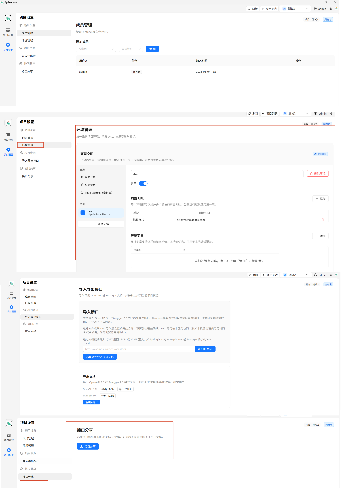

# ApiMocktle

**Mock**（模拟，类似鹦鹉学舌，突出 API 模拟能力）+ **Turtle**（龟，象征数据结构稳定）→ **Mocktle**。一个基于 **Tauri v2 + React + Rust + SQLite** 的本地优先 API 管理桌面应用。

当然上面的名字是先射箭画靶，AI给我取得，真实原因是因为我养了鹦鹉🦜和乌龟🐢，然后Deepseek给我取了这个名字

它把注册登录、项目管理、接口目录、文档与数据模型编辑、环境变量、请求调试、Swagger/OpenAPI 导入导出等能力整合到一个可离线运行的桌面应用里，数据完全掌握在用户本地。

## 更新日志

### v1.4.3 (2026-06-08)

- 📂 **测试任务文件夹分组** — 左右分栏布局（文件夹侧边栏 + 任务表格），支持新建、重命名、删除文件夹，任务可在文件夹间移动，无文件夹的任务归入「默认」
- 📊 **首页自测数量** — 项目卡片新增「自测」计数，展示每个项目的测试任务总数
- ✏️ **任务编辑 Modal** — 编辑按钮改为弹窗模式，可直接修改任务名称、描述、失败即停配置
- 🤖 **MCP 工具增强** — `create_task` / `create_task_with_flow` 新增 `folderId` 和 `folderName` 参数（`folderName` 不存在时自动创建），`list_tasks` 返回附带 `folderName`

### v1.4.2 (2026-06-07)

- ⚡ **执行引擎功能补全** — 新增 PreScript 前置脚本（支持修改请求参数 + 写入变量）、While/ForEach 循环类型、条件等待（轮询表达式 + 超时）、子流程执行（加载并执行目标任务流程图）、循环失败策略可配置（`breakOnFailure`）、执行记录持久化到数据库
- ✅ **流程校验** — 工具栏新增校验按钮，检查起止节点、边引用、孤立节点等结构问题
- 🗂️ **节点大纲面板** — 左侧面板新增节点列表，按类型分组，支持搜索和点击定位画布节点
- 🎨 **运行时画布高亮** — 运行中节点脉冲动画、通过绿色边框、失败红色边框
- 📜 **执行历史面板** — 左侧面板新增执行记录列表，点击可查看每步详情（请求/响应/耗时）
- 🔤 **HTTP Header 大小写不敏感** — 提取器、断言、请求覆盖中的 header 名称不再区分大小写

### v1.4.1 (2026-06-04)

- 📝 **侧边栏菜单优化** — 「自动化测试」菜单名缩短为「自测」，节省侧边栏空间

### v1.4.0 (2026-06-01)

- 🎨 **可视化测试流程编辑器** — 全新的拖拽式流程画布，支持 9 种节点类型：开始、结束、HTTP 请求、条件判断、循环、等待、并行、变量赋值、断言
- 🧠 **MCP 服务（AI Agent 集成）** — 新增 18 个 MCP 工具，AI Agent 可通过 `get_flow_context` 获取完整 API 参数信息，通过 `create_task_with_flow` 一键创建测试任务
- 🔄 **流程执行引擎** — 前端流程图遍历引擎，支持环境选择、实时日志面板、节点状态高亮、快速失败模式
- 📐 **ELK 自动布局** — 使用 ELK.js 分层布局算法替代 dagre，自动最小化边交叉，连线采用直角折线自动绕过节点
- 🤖 **AI Prompt 生成** — 导入弹窗提供完整的 Prompt 模板，包含项目 API 参数详情（自动解析 `$ref` 引用）、节点类型文档、断言/提取器格式说明
- 📝 **请求覆盖可视化** — Query/Header/Path 参数使用 KV 可视化编辑器，Body 使用 JSON 编辑器
- 🔗 **连线增强** — 贝塞尔/折线切换、方向箭头、条件分支标注（符合/不符合）、循环体/出口标注、连线选中/删除/重连
- 🖱️ **节点交互增强** — 节点选中高亮、右键菜单删除、节点上显示运行结果和耗时
- 💾 **保存按钮** — 工具栏新增保存按钮 + Ctrl+S 快捷键
- 🏷️ **条件节点优化** — 支持 expression/status_code/variable_check 三种模式，节点显示实际表达式，配置页面按类型动态显隐字段
- 🔧 **断言修复** — 修复 status 类型断言数字/字符串类型不匹配问题，断言失败信息显示预期值和实际值
- 📦 **依赖变更** — 新增 elkjs（自动布局），移除 dagre

### v1.3.4 (2026-05-28)

- 🔀 **RunTab 数据分离** — 运行时信息（参数、Body、脚本等）与 API 定义分离存储，运行时修改不再覆盖文档定义
- 💾 **runTabInfo 独立存储** — 新增 `run_tab_json` 列存储运行时信息，只保存与文档定义不同的部分
- 🔄 **一键复原增强** — 复原弹窗支持三个选项：关闭、复原到文档定义、复原到保存点
- ⌨️ **Ctrl+S 修复** — 修复 Ctrl+S 保存只在当前激活的子 Tab 生效，避免重复触发
- 📦 **数据库迁移** — 自动为现有数据库添加 `run_tab_json` 列

### v1.3.3 (2026-05-28)

- 🔧 **修复一键复原** — 修复运行 Tab 复原按钮无法还原 Query 参数、Headers、Cookie 和脚本的问题，现在能正确恢复所有字段到文档原始值
- ✂️ **脚本 API 简化** — `pm.environment` 重命名为 `pm.env`，更简短易写（涉及脚本引擎、类型定义、自动补全、帮助文档）
- 📝 **会话变量面板** — 新增会话变量管理面板，支持查看和编辑跨请求共享的会话级变量

### v1.3.2 (2026-05-25)

- 🏷️ **多项目标签页** — 支持同时打开多个项目，像浏览器标签页一样切换，每个项目独立维护接口树、环境和标签状态
- 🧭 **项目标签栏** — 顶部标签栏支持右键菜单（关闭、关闭其他、关闭右侧、全部关闭、复制名称），活跃标签高亮显示
- 🔄 **快速切换** — 标签栏新增项目快速切换下拉 + 刷新按钮 + 返回项目列表入口
- 🎨 **布局重构** — 用户菜单和设置按钮移至左下角侧边栏底部，刷新和项目列表移至标签栏同一行
- 📊 **项目列表统计** — 项目卡片展示 API 数量、模型数量、快捷请求数量，快速概览项目规模
- 👤 **侧边栏用户菜单优化** — 侧边栏只显示用户图标，点击弹出菜单展示用户名和操作项，避免长用户名撑开布局
- 🕐 **运行历史记录** — 接口运行和快捷请求运行自动保存历史（每个接口最多 10 条），右侧 Drawer 查看完整请求参数和响应详情
- ⚠️ **异常也保存历史** — 请求异常（未登录、无权限等）同样保存错误信息，方便追溯问题
- 🧹 **消除控制台警告** — 修复 antd `Input` `bordered` 废弃 prop，修复 react-resizable-panels 布局尺寸初始值不合理问题

### v1.3.1 (2026-05-24)

- 🐛 **修复菜单树双击选中文字** — 禁用接口管理树形目录的双击文本选择
- 🔄 **编辑/运行场景区分示例值** — 编辑模式下显示示例值，运行模式下优先显示请求值（已填入的参数）

### v1.3.0 (2026-05-18)

- 💬 **结构化错误提示** — HTTP 请求和代理连接错误现在展示中文分类消息 + 修复建议 + 可展开技术详情
- 🧭 **错误分类** — 后端自动区分 DNS 解析失败/连接被拒/超时/TLS 错误等 8 种场景，给出针对性解决方案
- 🔄 **一键重试** — 错误面板提供重试按钮，快速重新发起请求
- 📄 **自动切到响应** — 运行请求成功后，结果区域自动选中「响应内容」标签页
- 🔒 **跳过证书验证** — HTTPS 请求支持一键跳过 TLS 证书校验，方便调试自签名证书接口
- ✏️ **内联标题编辑** — 快捷请求和修改文档页面支持内联修改标题，侧边栏即时同步
- ⌨️ **Ctrl+S 保存** — 所有保存页面支持 Ctrl+S/Cmd+S 快捷键
- 🐛 **修复技术详情不展开** — 修复错误面板中「技术详情」无法展开的问题

### v1.2.0 (2026-05-13)

- 🌐 **全局网络代理** — 设置页面新增「网络代理」标签页，支持 SOCKS5 和 HTTP(S) 两种代理类型
- ⚙️ **配置持久化** — 代理配置写入 `app_data_dir/config/app_config.json`，应用更新不丢失
- 🔄 **实时同步** — 修改代理设置后，请求页面指示器和实际请求即时生效
- 🏷️ **代理指示器** — RunTab/快捷请求/结果页显示代理类型 Tag，悬停显示 host:port
- 🔗 **测试连接** — 支持自定义 URL 测试代理连通性
- 🎨 **图标库扩展** — 图标数量扩展至 885 个，分类合并为 7 类，优化选择器 UI

### v1.1.1 (2026-05-12)

- 📐 **运行 Tab 布局优化** — 添加可拖拽分隔面板，修复横向溢出问题
- 🔧 **移除 Auth 模块** — 移除快捷请求和文档编辑中的认证相关模块
- 🗂️ **项目列表优化** — 优化项目列表页布局和卡片样式

### v1.1.0 (2026-05-11)

- ✨ **粒子动效** — 登录页和项目列表页添加粒子动效背景及花纹
- 📎 **文件上传** — 支持 form-data 文件上传功能
- 🏷️ **版本号管理** — 添加基于 Git tag 的版本号显示
- 🐛 **Bug 修复** — 修复 JsonSchema 引用模型选择器、特殊字段删除线样式等
- 🧹 **UI/UX 优化** — 优化交互细节，去除无用面板

### v1.0.1 (2026-05-10)

- 📄 **响应格式化** — 运行界面响应内容自动格式化 JSON
- 💡 **字段提示** — API 文档中的字段名称和描述添加工具提示
- 🔄 **环境参数系统** — 完善全局/环境参数合并、启用开关、变量输入增强
- 🐛 **Bug 修复** — 修复环境管理表头重复 key 警告、禁用参数时无法删除条目等问题

## 为什么做这个项目

相比依赖外部服务的 API 管理工具（如 Apifox、Postman），更希望把常用的接口管理能力放到一个可以自行审计、运行和改造的代码库里。结合 Tauri 桌面框架，做到真正的本地优先、离线可用、无数据外泄风险。（例如著名的API工具投毒事件）

## 软件部分功能截图
1. 项目管理列表


3. 接口管理


3. 接口运行


4. 项目设置


5. 同步设置以及案例

## 核心能力

### 项目管理
- 用户注册、登录、记住密码 + 记住登录状态（可选 1/3/7/30 天/永久）
- 创建、重命名、删除项目，支持项目图标
- 成员管理：搜索用户直接加入项目，支持 owner/editor/viewer 三种角色
- 修改密码

### 接口管理
- 树形目录，支持拖拽排序、重命名、复制、移动、删除、回收站恢复
- 资源类型：API 接口 / Markdown 文档 / 数据模型 / 快捷请求
- 接口编辑：路径、Query/Path/Header/Cookie 参数、Body（JSON/XML/form-data/url-encoded/raw/binary）
- Body JSON 支持树形 Schema 编辑器（字段名、类型、示例值、说明）
- 返回响应支持多个 HTTP 状态码，每个响应独立定义 JSON Schema
- 数据模型支持 `$ref` 引用，跨接口复用 Schema 定义

### 环境管理
- 前置 URL、环境变量（支持 `{{varName}}` 模板语法，运行时自动替换）
- 全局 Header / Query / Cookie / Body 参数
- 个人本地值与团队值的优先级覆盖

### 请求调试
- Run Tab 独立运行接口，查看响应内容/响应头/cURL 命令
- 支持 Query 参数 + Body JSON 同时发送
- 环境变量 `{{x}}` 在运行时自动解析
- 一键填充：从 Schema 示例或 default 值自动生成 Body JSON

### 导入导出
- 导入：OpenAPI 3.x / Swagger 2.0 JSON/YAML，静默合并到当前项目
- 导出：完整 OpenAPI 3.0 / Swagger 2.0 规范文档（含 paths + definitions/schemas）
- cURL 导入单条请求
- 接口分享：导出 Markdown 文档

### 个人 Token（YAPI 兼容）
- 用户创建个人 Token，用于[Java插件](https://github.com/xiaohuiduan/ApiMocktle-java-plugin)同步
- `/api/project/list` 返回用户有权限的项目列表
- 插件可选择目标项目进行同步

## 技术栈

| 层 | 技术 |
|---|---|
| 桌面框架 | Tauri v2 |
| 前端 | React 18 + React Router v7 + Vite |
| UI | Ant Design v5 + TailwindCSS + Lucide React |
| 编辑器 | Monaco Editor（JSON 输入）+ ByteMD（Markdown） |
| 画布 | @xyflow/react（流程图）+ ELK.js（自动布局）|
| 后端 | Rust + Axum（YAPI/MCP HTTP 服务） |
| 数据库 | SQLite（rusqlite） |
| 实时协作 | Yjs CRDT（在线文档） |

## 项目结构

```text
src/                   前端源码
  app/                 页面路由
  components/          UI 组件（ApiTab、JsonSchema、项目面板等）
  contexts/            React Context（auth、menu-helpers、global）
  features/
    test-flow/         测试流程编辑器
      components/      画布、工具栏、节点面板、配置抽屉、导入弹窗、运行弹窗
      nodes/           节点组件（BaseNode、ConditionNode、LoopNode 等）
      store/           Zustand store（useFlowStore）
      hooks/           执行引擎（useFlowExecution）、持久化（useFlowPersistence）
      types/           流程类型定义
      contexts/        FlowEditorContext、FlowInstanceContext
  hooks/               全局 hooks（useApiMenu、useTestTask 等）
  utils/               工具函数（Markdown/HTML 导出）

src-tauri/             Rust 后端
  src/
    commands/          Tauri 命令（auth、projects、menu_items、test_tasks、test_flow、environments）
    db/                SQLite 仓储（auth_repo、project_repo、menu_repo、test_repo、flow_repo）
    services/          业务逻辑（导入解析、测试引擎 test_engine）
    http/              YAPI 兼容 HTTP 服务 + MCP 服务（mcp_server）
  Cargo.toml
```

### 自动化测试（v1.4.0 新增）

| 功能 | 说明 |
|---|---|
| 流程编辑器 | 拖拽节点、连线编辑、自动布局、导入导出 JSON |
| 节点类型 | start / end / httpRequest / condition / loop / wait / parallel / setVariable / assert |
| 运行引擎 | 环境选择、变量传递、断言/提取器、快速失败、实时日志 |
| AI 集成 | MCP 服务（18 个工具）、AI Prompt 生成、`$ref` Schema 解析 |
| 项目结构 | 流程图存储在 `test_flow_graphs` 表，与 `test_tasks` 关联 |

## 快速开始

### 环境要求

- Node.js `>= 20`
- pnpm `>= 9`
- Rust (stable toolchain)

### 安装依赖

```sh
pnpm install
```

### 启动开发环境

```sh
pnpm tauri:dev
```

### 构建

```sh
pnpm tauri:build
```

## 数据库

- 默认位置：`%APPDATA%/com.apimocktle.app/runtime/apimocktle.sqlite`（Windows）
- 启动时自动创建所需表结构
- 表包括：users、sessions、projects、project_members、menu_items、recycle_items、meta、share_links、personal_tokens

## 导入导出说明

- 导入支持 `.json`、`.yaml`、`.yml`
- OpenAPI 3.x 和 Swagger 2.0 均可导入
- 导出生成完整的 OpenAPI 3.0 / Swagger 2.0 规范文档
- 导入采用静默合并策略，不会清空已有资源

## 致谢

1. 本项目的界面与交互参考了 [Codennnn / Apifox-UI](https://github.com/Codennnn/Apifox-UI)。感谢原作者提供高质量的 UI 设计还原与开源分享，这个项目在此基础上继续做了适配、重构和演进。
2. 感觉[qq201128 / Apifox-Local](https://github.com/qq201128/Apifox-Local)在Apifox-UI的基础上增加了很多功能，能够让我在其上面的基础上添加更多的功能。
3. 感谢mimo 100T计划，给我提供的免费2亿credits套餐（虽然我一天就蹬完了🤣）。
4. 感谢伟大的DeepSeek V4 pro，在五一期间降价，让我疯狂蹬，花费却不到100，完成了项目所有内容。
